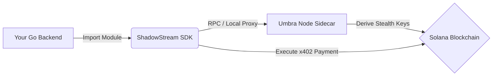

Here is a concise, professional `README.md` for your submission.

```markdown
# ShadowStream 🌑 🌊

**The First Server-Side Privacy Automation Layer for Solana**

[](https://pkg.go.dev/github.com/sushmitsarmah/shadowstream)
[](https://solana.com)
[](https://opensource.org/licenses/MIT)

ShadowStream is a modular privacy layer that bridges **ShadowPay’s** x402 payment infrastructure with **Umbra’s** stealth address protocol. 

It packages complex privacy cryptography into a drop-in **Go SDK**, enabling developers to build automated, private transaction flows for trading bots, AI agents, and payroll systems without managing low-level ZK proofs.

---

## 🚀 Why ShadowStream?

Building private apps on Solana is hard. Most privacy tools are designed for browser wallets, leaving backend developers stranded.

- **For Bots & Agents:** Automate payments without manual wallet approval.
- **Double-Blind Privacy:** Breaks the link between sender (via ShadowPay Relayer) and receiver (via Umbra Stealth Addresses).
- **Developer Friendly:** A simple Go module that abstracts away Elliptic Curve cryptography and Zero-Knowledge proofs.

---

## 🏗 Architecture

ShadowStream bridges two powerful ecosystems using a **Sidecar Pattern**:



1. **ShadowStream SDK (Go):** Handles orchestration, scheduling, and business logic.
2. **Umbra Sidecar (Node.js):** A lightweight microservice that handles the heavy cryptographic lifting (Stealth Derivation & ZK Proofs) via the `@umbra-defi/sdk`.

---

## 🛠 Getting Started

### Prerequisites

* Go 1.20+
* Node.js 16+ (for the sidecar)
* A Solana Wallet (devnet/mainnet)

### 1. Install the Sidecar

The sidecar handles the cryptography that isn't yet available in Go.

```bash
cd express_server
npm install
npm run start
# Running on http://localhost:3000

```

### 2. Install the Go Module

```bash
go get [github.com/sushmitsarmah/shadowstream](https://github.com/yourusername/shadowstream)

```

### 3. Usage

Import the module to trigger a private, automated payment.

```go
package main

import (
    "context"
    "fmt"
    "[github.com/yourusername/shadowstream](https://github.com/yourusername/shadowstream)"
)

func main() {
    // Initialize the client
    client := shadowstream.NewClient(
        "http://localhost:3000", // Sidecar URL
        "YOUR_SOLANA_PRIVATE_KEY",
    )

    // Trigger a private payment
    // The recipient receives funds to a new Stealth Address
    txSig, err := client.SendPrivatePayment(context.Background(), shadowstream.PaymentRequest{
        Recipient: "alice.sol", // Public address (we derive the stealth one)
        Amount:    1_000_000_000, // 1 SOL (in lamports)
    })

    if err != nil {
        panic(err)
    }

    fmt.Printf("Private Transaction Sent! Signature: %s\n", txSig)
}

```

---

## 🗺 Roadmap

* [ ] **Native Go Cryptography:** Porting Umbra's Elliptic Curve logic to Go to remove the Node.js sidecar requirement.
* [ ] **Webhooks:** Event system for notifying backends when stealth payments settle.
* [ ] **Redis Caching:** Optimizing stealth key derivation for frequent contacts.

## 📄 License

MIT © [ShadowStream]

```

```
